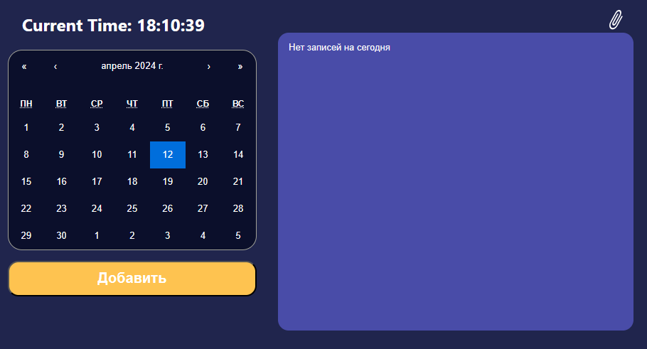

# Календарь-дневник
Программа представляет собой дневник-календарь, 
предназаченный для планирования и организации своего времени. 
Она может быть полезна для ведения личных записей, 
составления списков дел, фиксации важных событий и дат.

# Demo
https://zerroxturbo.github.io/calendar/

# Что может календарь-дневник
На данный момент в календарь-дневник можно записывать события, 
планы, задачи и сохранять их. Можно прикреплять фото.
